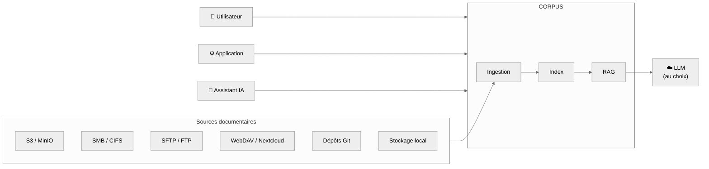

## L'essentiel

> Vos documents métier sont **partout** : partages réseau, Nextcloud, SharePoint, S3, dépôts Git, boîtes mail. Vos collaborateurs **ne les retrouvent plus** et se rabattent sur des IA externes en y copiant-collant vos contenus sensibles.
>   
> Corpus vous donne le **point d'entrée documentaire unique** qui manque à votre SI : une plateforme auto-hébergée qui indexe vos fonds existants, répond en langage naturel **avec citation systématique des sources**, et préserve votre **liberté de choix technologiqe** sur le LLM. Déploiement Docker en quelques minutes, données chez vous, code auditable (AGPLv3).

## Le problème que vous avez déjà

La recherche documentaire en entreprise s'est dégradée par l'accumulation, pas par manque d'outils. Pour une DSI, cela se traduit par :

- **Dispersion** : les contenus utiles sont éclatés sur 5 à 10 systèmes hétérogènes, sans recherche unifiée.
- **Shadow search IA** : faute de moteur interne efficace, les équipes copient-collent des documents internes dans ChatGPT ou Claude.
- **Perte de mémoire** : l'information existe, mais elle est introuvable, donc refaite, ou ignorée.
- **Traçabilité** : les réponses des IA externes ne citent jamais vos sources. Impossible de vérifier, d'auditer, de prouver.
- **Verrouillage** : chaque éditeur propose son propre "assistant IA" propriétaire, avec vos données chez lui.

## La réponse Corpus

Un moteur de **recherche augmentée par IA (RAG)** qui se branche sur vos sources documentaires existantes, **sans migration**, et expose une interface de questions-réponses sourcées, accessible aux utilisateurs, aux applications métier, et aux assistants IA via le protocole **MCP**.

## Vue d'ensemble fonctionnelle

| DOMAINE          | CAPACITÉ CORPUS                                           | BÉNÉFICE DSI                                    |
| ---------------- | --------------------------------------------------------- | ----------------------------------------------- |
| **Sources**      | Connecteurs S3, SMB, SFTP, WebDAV, Git, local             | Valorisation de l'existant, zéro migration      |
| **Formats**      | Bureautique, PDF, OCR images, Markdown, ePub…             | Aucun reformatage demandé aux métiers           |
| **Recherche**    | Hybride : mots-clés + sémantique + reformulation IA       | Pertinence sans dépendance au vocabulaire exact |
| **Q&R**          | Réponses générées **avec citation des sources**           | Traçabilité native, vérifiabilité               |
| **Identité**     | OIDC (Azure AD, Okta, Google, GitHub…)                    | Aucun annuaire parallèle                        |
| **Gouvernance**  | Collections cloisonnées, partage granulaire               | Droits par projet / équipe / direction          |
| **LLM**          | Choix libre : Mistral, OpenAI, OpenRouter, **ou interne** | Réversibilité, souveraineté de la donnée        |
| **Intégration**  | API REST + serveur **MCP**                                | Branchement aux outils et assistants existants  |
| **Exploitation** | Docker, SQLite embarqué, AGPLv3                           | Déploiement et MCO simplifiés, code auditable   |

---

## Ingestion multi-format

**Vos documents tels qu'ils sont.**

Corpus convertit et indexe automatiquement les formats déjà en usage dans votre organisation. Aucune contrainte de reformatage côté métier.

| FAMILLE                   | FORMATS PRIS EN CHARGE                           |
| ------------------------- | ------------------------------------------------ |
| **Bureautique**           | .docx, .doc, .xlsx, .pptx, .odt                  |
| **Documents & scans**     | PDF, JPEG, PNG, TIFF, HEIC (OCR / extraction IA) |
| **Texte & doc technique** | Markdown, HTML, ePub, RTF, XML, Jupyter          |

> **CONSÉQUENCE OPÉRATIONNELLE :** les collaborateurs continuent de produire dans leurs outils habituels. Corpus s'adapte au SI, pas l'inverse.

---

## Connecteurs aux sources existantes

**Pas de migration. Pas de duplication. Pas de référentiel parallèle.**

Corpus surveille et synchronise vos sources documentaires en place :

- **Stockage objet** compatible S3 (MinIO, AWS S3…)
- **Partages réseau** SMB/CIFS, FTP, SFTP
- **WebDAV** (Nextcloud, ownCloud…)
- **Dépôts Git** (documentation versionnée)
- **Disques et partages locaux**

La détection des nouveaux fichiers et des modifications déclenche une **ré-indexation automatique en arrière-plan**.

> **CONSÉQUENCE STRATÉGIQUE :** vos investissements documentaires existants (GED, Nextcloud, S3, Git) sont **valorisés**, pas remplacés. La réversibilité est native : couper Corpus ne fait perdre aucune donnée.

---

## Recherche hybride et questions-réponses sourcées

Corpus combine plusieurs technologies pour maximiser la pertinence :

| TECHNIQUE            | RÔLE                                                     |
| -------------------- | -------------------------------------------------------- |
| Recherche full-text  | Précision sur les termes exacts                          |
| Recherche sémantique | Compréhension du sens de la requête                      |
| Reformulation IA     | La question est réécrite pour mieux cibler les documents |
| Filtrage IA          | Élimination des faux positifs                            |

### Le mode "Ask" : répondre, pas seulement trouver

L'utilisateur pose une question en langage naturel. Corpus génère une réponse synthétique **toujours accompagnée des extraits de documents** qui l'ont fondée.

> **CONSÉQUENCE MÉTIER :** chaque affirmation est **traçable et vérifiable**. Point bloquant pour les usages juridiques, conformité, qualité, résolu par défaut.

---

## Gouvernance documentaire et droits d'accès

**Une gouvernance fine, sans complexité d'exploitation.**

- **Authentification fédérée OIDC** : Azure AD, Okta, Google, GitHub, Keycloak…
- **Attribution automatique des rôles** selon le domaine email.
- **Collections** organisées par projet, équipe ou thématique.
- **Partage granulaire** : lecture seule ou écriture, par utilisateur.
- **Partage public sécurisé** : exposer une Q&R sur une collection à des externes via lien maîtrisé, sans création de compte.

| CAS D'USAGE           | APPORT DE CORPUS                                  |
| --------------------- | ------------------------------------------------- |
| Direction RH          | Collection privée, accès limité aux ayants droit  |
| Service juridique     | Q&R sourcée pour audit et conformité              |
| Communication externe | Partage public d'une FAQ sourcée                  |
| Groupe avec filiales  | Collections cloisonnées, gouvernance différenciée |

> **CONSÉQUENCE DSI :** un seul socle à exploiter, mais une gouvernance différenciée par entité métier.

---

## Souveraineté et liberté de choix du LLM

**Aucun verrouillage. Vos données restent où vous décidez.**

Corpus est **agnostique du fournisseur de modèle**. Vous choisissez :

| OPTION                                                | USAGE TYPIQUE                       |
| ----------------------------------------------------- | ----------------------------------- |
| **LLM européen** (Mistral, OVHcloud AI Endpoints…)    | Conformité, souveraineté            |
| **LLM international** (OpenAI, Anthropic, OpenRouter) | Performance générale                |
| **LLM auto-hébergé** (vLLM, Ollama…)                  | Donnée sensible, zéro sortie réseau |
| **Combinaison** via Xolo                              | Routage selon la criticité          |

| DONNÉE                  | LOCALISATION                                |
| ----------------------- | ------------------------------------------- |
| Documents indexés       | Votre infrastructure                        |
| Index et embeddings     | Votre infrastructure                        |
| Identités               | Votre IdP                                   |
| Historique des requêtes | Votre infrastructure                        |
| Appels LLM              | Fournisseur **de votre choix** (ou interne) |

> **CONSÉQUENCE CONFORMITÉ :** la démonstration de maîtrise de la donnée auprès du DPO, du RSSI ou d'un auditeur devient **SIMPLE ET FACTUELLE**.

---

## Intégration au SI et aux assistants IA (MCP)

Corpus n'est pas une île. C'est un **composant** de votre architecture IA.

| INTERFACE             | USAGE                                                                               |
| --------------------- | ----------------------------------------------------------------------------------- |
| **Interface web**     | Recherche, Q&R, gestion des collections, supervision                                |
| **API REST complète** | Intranet, portails métier, BI, automatisations (Zapier, N8N)                        |
| **Serveur MCP**       | Branchement direct des assistants IA (Claude, Copilot…) sur votre base documentaire |

> **CONSÉQUENCE STRATÉGIQUE :** les assistants IA déjà utilisés par vos collaborateurs deviennent **utiles sur vos contenus internes** sans copier-coller, sans fuite, sans changement d'outil.

---

### Cas d'usage prioritaires

| PERSONA / DIRECTION      | USAGE TYPIQUE                         | APPORT CORPUS                  |
| ------------------------ | ------------------------------------- | ------------------------------ |
| **DSI**                  | Point d'entrée documentaire unifié    | Connecteurs natifs, API, MCP   |
| **RSSI**                 | Réduction du shadow IT IA             | Auto-hébergement, LLM au choix |
| **DPO**                  | Conformité RGPD documentaire          | Traçabilité, sources citées    |
| **Direction Juridique**  | Recherche sourcée et vérifiable       | Mode Ask avec extraits         |
| **Direction RH**         | Base de connaissances interne         | Collections privées, OIDC      |
| **Direction Métier**     | Assistant documentaire spécialisé     | Collections thématiques        |
| **Direction Innovation** | Brique RAG pour applications internes | API REST, open source          |

### Ce que vous gagnez, en synthèse

| ENJEU DSI          | AVANT CORPUS                     | AVEC CORPUS                     |
| ------------------ | -------------------------------- | ------------------------------- |
| **Findability**    | Recherche éclatée sur N systèmes | Point d'entrée unique           |
| **Shadow IT IA**   | Documents copiés dans ChatGPT    | Q&R interne sourcée             |
| **Traçabilité**    | Réponses IA sans sources         | Citation systématique           |
| **Migration**      | Coûteuse, risquée                | Aucune : connecteurs natifs     |
| **Verrou LLM**     | Dépendance éditeur               | LLM au choix, y compris interne |
| **Souveraineté**   | Documents chez des tiers         | Données chez vous               |
| **Intégration IA** | Assistants déconnectés du SI     | MCP natif                       |
| **Exploitation**   | Outils propriétaires hétérogènes | Docker, SQLite, AGPLv3          |
